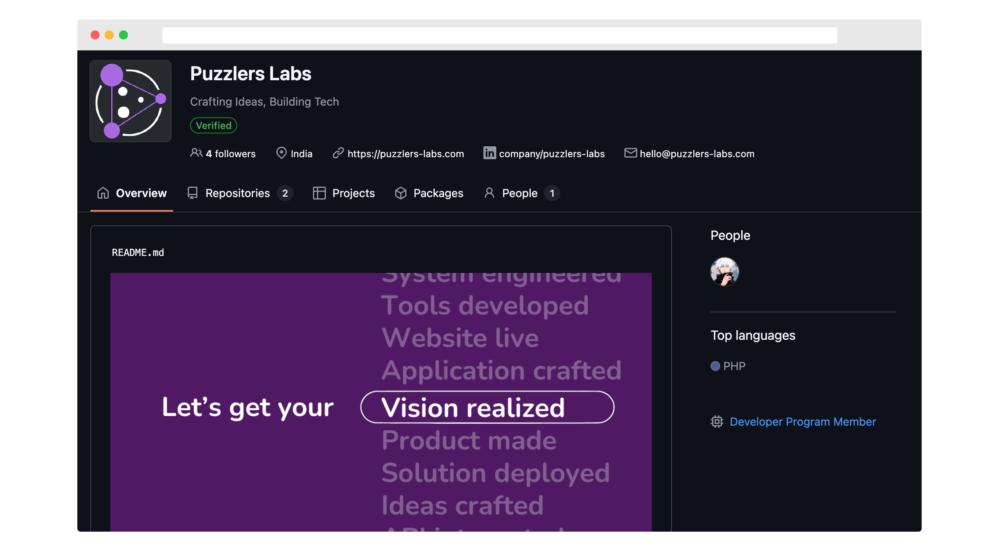

[](https://github.com/puzzlers-labs/)

# Puzzlers Labs GitHub Profile

This .github repository for Puzzlers Labs is a special-purpose GitHub repository used to customize the organization’s profile page. By managing this repository, we ensure that visitors to our GitHub organization receive up-to-date and relevant information about Puzzlers Labs and its projects.

## About the Repository

This repository defines the content displayed on the Puzzlers Labs GitHub organization profile. It is structured to provide an appealing and informative first impression for anyone visiting our profile.

## Repository Structure

```
├── profile/         # Contains the content for the organization profile
│   └── README.md    # Markdown file displayed on the organization profile
└── README.md        # Documentation for this repository
```

Key Files:

- **profile/README.md**: This file contains the markdown content that appears directly on the Puzzlers Labs GitHub organization profile.

## How It Works

GitHub automatically renders the profile/README.md content on the organization’s main profile page. Any updates to this file in the .github repository are reflected immediately on the Puzzlers Labs profile.

## Usage

### Customizing the Profile

1. Edit the profile/README.md file to update the profile content.
2. Commit and push changes to this repository.
3. Changes will be visible on the GitHub organization profile instantly.

### Maintaining Content

- Keep the content concise and relevant.
- Highlight the latest projects, accomplishments, or announcements.

## Contact

Interested in collaborating with Puzzlers Labs or learning more about our services? Get in touch with our sales team:

- **Website**: [Puzzlers Labs](https://puzzlers-labs.com)
- **Email**: [hello@puzzlers-labs.com](mailto:hello@puzzlers-labs.com)

We look forward to partnering with you to create innovative solutions!

## License
This project is licensed under the Creative Commons Attribution-NonCommercial 4.0 International License. You can use, share, and modify the code, but not for commercial purposes without permission.

For more details, see the [LICENSE](LICENSE) file.