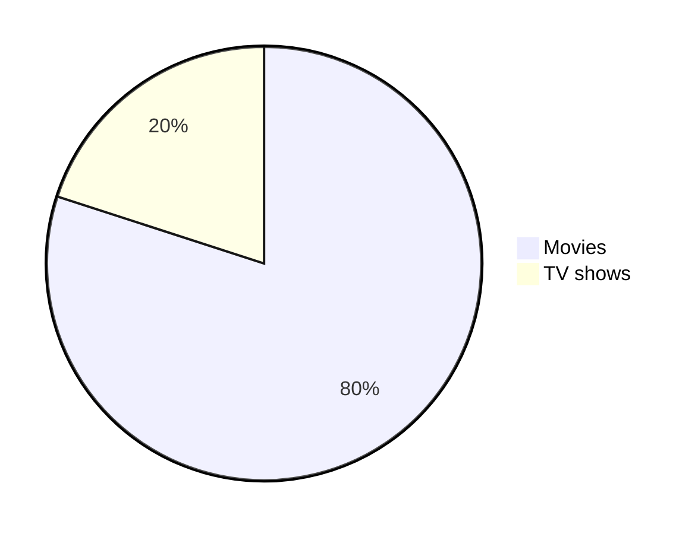

  <picture>
    <source media="(prefers-color-scheme: dark)" srcset="https://raw.githubusercontent.com/puzzlers-labs/.github/main/profile/assets/dark_mode_logo.png">
    <source media="(prefers-color-scheme: light)" srcset="https://raw.githubusercontent.com/puzzlers-labs/.github/main/profile/assets/light_mode_logo.png">
    
  </picture>

<h1 align="center">
  Hello | नमस्ते | Bonjour | สวัสดี | Hola | مرحبا | こんにちは
</h1>

We are Puzzlers Labs. A Bespoke Software Development Company.

    
About Us

    Something small enough to escape casual notice.

---

> [!TIP]
> Try changing the theme and see the logo change on this README.

[:arrow_up:](#top)

<!--

**Here are some ideas to get you started:**

🙋‍♀️ A short introduction - what is your organization all about?
🌈 Contribution guidelines - how can the community get involved?
👩‍💻 Useful resources - where can the community find your docs? Is there anything else the community should know?
🍿 Fun facts - what does your team eat for breakfast?
🧙 Remember, you can do mighty things with the power of [Markdown](https://docs.github.com/github/writing-on-github/getting-started-with-writing-and-formatting-on-github/basic-writing-and-formatting-syntax)
-->
