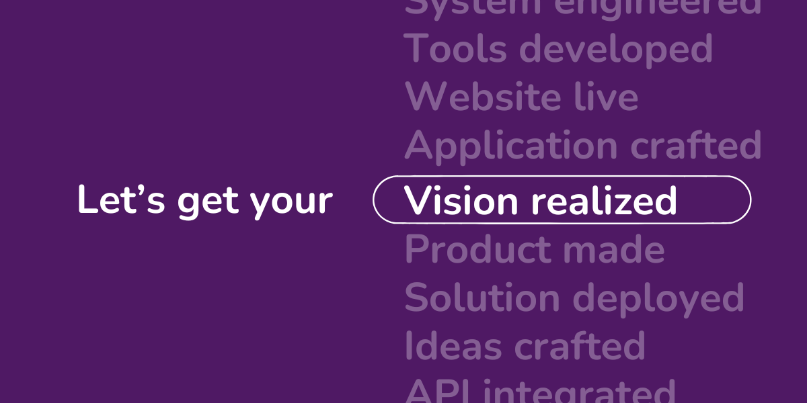

<h3 align="center">
	Hello | नमस्ते | Bonjour | สวัสดี | Hola | مرحبا | こんにちは
</h3>

# Welcome to Puzzlers Labs

Transforming Enterprises with Impactful and Accessible Technologies

At Puzzlers Labs, we are driven by a commitment to create bespoke solutions that bridge innovation and accessibility. Guided by our vision of "Transforming Enterprises with Impactful and Accessible Technologies," and our mission to empower businesses with tailored, high-quality solutions, we bring over 7 years of experience in building apps, websites, and cutting-edge tools to deliver results that exceed expectations.

# 🌟 What We Do

- 🌎 **Web Development:** Precision-built websites that bring your vision to life online.
- 📱 **Mobile App Development:** Engaging, scalable apps for iOS and Android platforms.
- 🖥️ **Desktop Application Development:** Robust software solutions for enhanced productivity.
- 🤖 **API Development:** Seamless integration and custom APIs for all your data needs.
- 🤝 **Software Consultation:** In-depth expertise to elevate your tech strategies.
- 📧 **Google Workspace Solutions:** Streamlined setups for optimized collaboration.

# 🚀 Our Philosophy

We believe in the power of collaboration, simplicity, and human-focused design. From startups to enterprises, our solutions are crafted to empower businesses with tools that drive growth and innovation.

# 🛠️ Open Source Contributions

At Puzzlers Labs, we value community-driven development. Many of our projects are open-source, encouraging collaboration and learning across industries.
Explore some of our open-source repositories:

- [Stupid Simple Meta Tags](https://github.com/puzzlers-labs/stupid_simple_meta_tags) - A WordPress plugin simplifying metadata management for better SEO and social media visibility.

# 📫 Get in Touch

Have an idea or a project in mind? Let’s collaborate!

- 🌐 [Website](https://puzzlers-labs.com/)
- 📧 [Email Us](mailto:hello@puzzlers-labs.com)
- 💼 [LinkedIn](https://www.linkedin.com/company/puzzlers-labs)

Follow us to stay updated with the latest projects and innovations from Puzzlers Labs. Together, let’s build the future of technology.

---

<picture>
	<source media="(prefers-color-scheme: dark)" srcset="images/dark_mode_logo.png" align="right" height="80">
    <source media="(prefers-color-scheme: light)" srcset="images/light_mode_logo.png" align="right" height="80">
    
</picture>

> [!TIP]
> **Tip:** Switch between light and dark themes to see the logo adapt accordingly.

	<i>𝓯𝓲𝓷</i>

